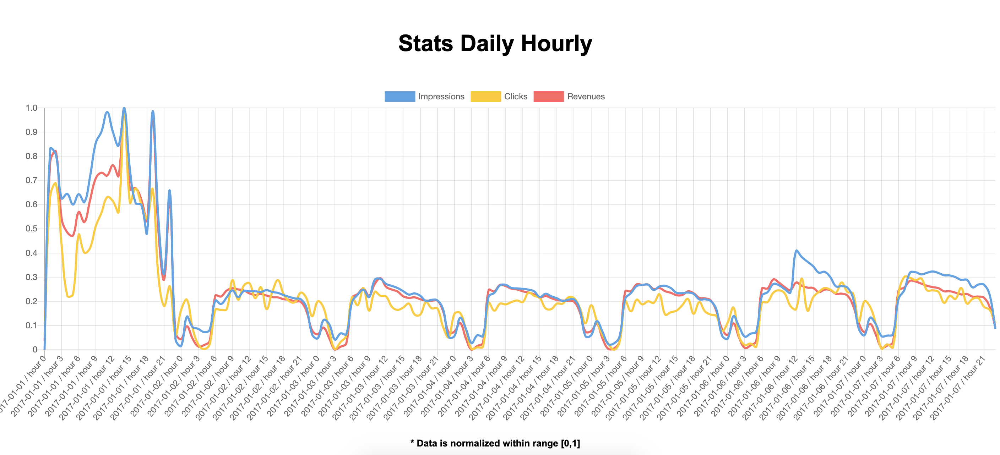
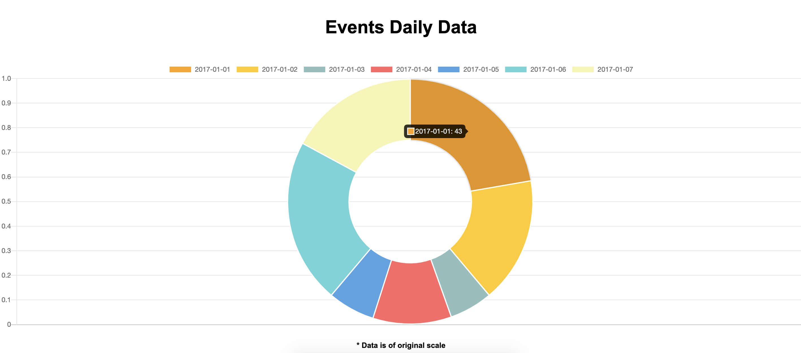

# EQ-Works Data Visualizer
A simple data visualization web-app that displays API data from EQ-Works API, built with React, Next.JS and Chart.js

## Features
- Line, bar and donut charts, displaying several different data sets
- Data normalization for multi-field  qualitative trend analysis

## Runnning Locally

Make sure you have Node.js, React and npm installed

    # Clone this repo by typing into your terminal
    $ git clone https://github.com/Justin-Kwan/EQ-Works-Data-Visualizer
  
    # Install npm dependencies
    $ npm install
  
    # Build application (Production)
    $ npm run build
  
    # Run application
    $ npm run start
